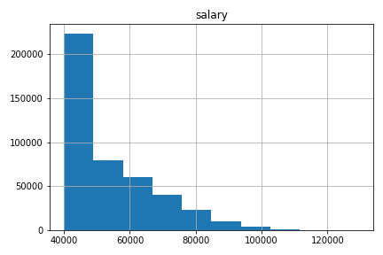

# Employee SQL Database

## **Objective:**
The objective of this project is to use SQL to perform data modeling, engineering and analysis of an employee database originally stored in 6 CSV files. The following steps were taken:

* **Data Modeling:** Inspected the CSV files and created an ERD of the tables.
* **Data Engineering:** Created a table schema for each CSV file and imported each file into the corresponding SQL table.
* **Data Analysis:** 
  - Created the following tables: 
    - Employee summary table.
    - List of employees hired in 1986.
    - Manager summary table.
    - List of all employees in the Sales and Development departments.
    - Frequency count of employee last names.
  - Created the following bar graphs:
    - Average salary by title.
    - Most common employee salary ranges.

## **Tools:**
1. SQL
2. Python - SQLAlchemy, Pandas, Matplotlib

## **Screenshots:**

#### Data Modeling

An ERD is sketched based on CSVs tables.

#### Data Engineering

Based on ERD, create a table schema for each of the six CSV files. Specify data types, primary keys, foreign keys, and other constraints.

#### Data Analysis

Once the database is completed, jupyter notebook is used to grab the SQL database and then plotted with matplotlib to produce the following graphs:

Average Salary by Title

Salary Range of Employees

In addition, SQL skills are practiced by answering the following queries:

1. List the following details of each employee: employee number, last name, first name, gender, and salary.

2. List employees who were hired in 1986.

3. List the manager of each department with the following information: department number, department name, the manager's employee number, last name, first name, and start and end employment dates.

4. List the department of each employee with the following information: employee number, last name, first name, and department name.

5. List all employees whose first name is "Hercules" and last names begin with "B."

6. List all employees in the Sales department, including their employee number, last name, first name, and department name.

7. List all employees in the Sales and Development departments, including their employee number, last name, first name, and department name.

8. In descending order, list the frequency count of employee last names, i.e., how many employees share each last name.

